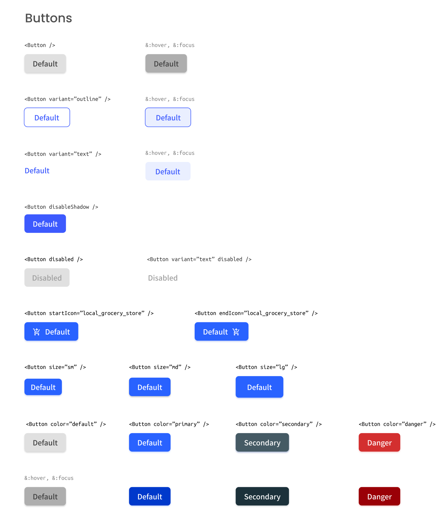

# Button component

**React Challenge:** Create a reusable button with all the states in the design and a page displaying all the states.

Fulfill user stories below:

-   **User story:** I can see different button types: *`default`*, *`outline`* and *`text`*
-   **User story:** I can choose to disable *`box-shadow`*
-   **User story:** I can choose to disable button
-   **User story:** I can choose to have an icon on the left or right (Use Google Icon and at least 5 variants)
-   **User story:**: I can have different button sizes
-   **User story:** I can have different colors
-   **User story:** When I hover or focus, I can see visual indicators
-   **User story:** I can still access all button attributes
-   **User story (optional):** Show button in a similar way like the design or use [Storybook](https://storybook.js.org/). Otherwise, showing the button in multiple states is enough

**Icon:** [https://google.github.io/material-design-icons/](https://google.github.io/material-design-icons/)

**Figma file:** [Link](https://www.figma.com/file/vfMDJhGGnqfaskO2aud06o/button-component?node-id=1%3A144&viewport=415%2C48%2C0.6118738651275635)

As long as you fulfill all the user stories, you can give your personal touches by adding transition, using your own images, changing colors, or even creating your own layout,...

Once you completed, update the README_template.md and paste **URLs for both GitHub repository and live app** on Netlify and explain briefly what you have done.

**Don’t look at the existing solution onlines.**

### How to deploy your solution to Netlify

[Netlify](https://www.netlify.com/) supports GitHub, GitLab, and Bitbucket, it will redeploy the site just by pushing the code without manually rebuild.

Step 1. Login to Netlify and select `New site from git`

Step 2. Choose your repository and configure settings with options:

-   Branch to deploy, default `master`
-   Build Command, default `npm run build`
-   Publish directory, default `public`, but it is usually `public, dist, build,...`

Step 3. Select `Deploy site`

Good luck!
